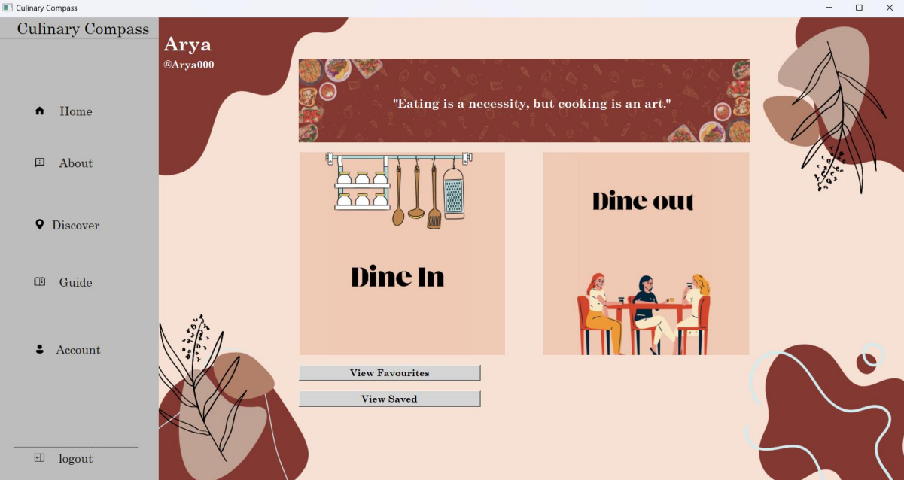
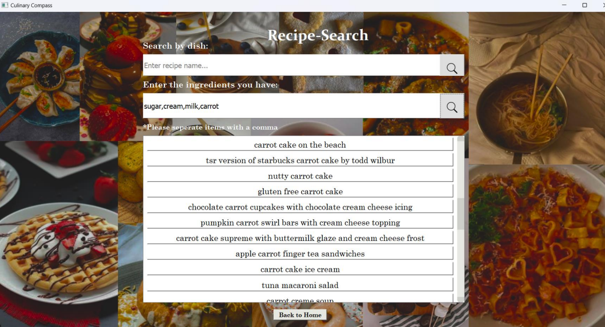
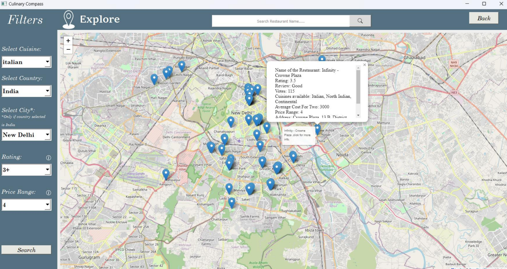
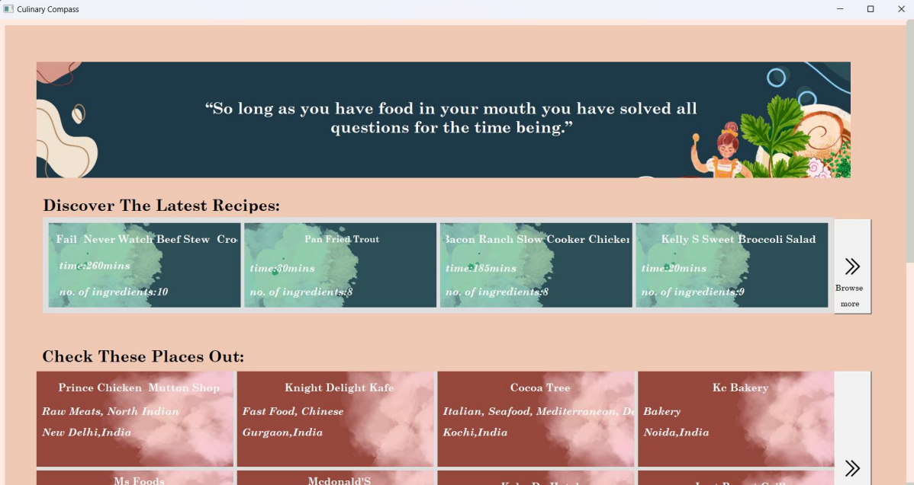
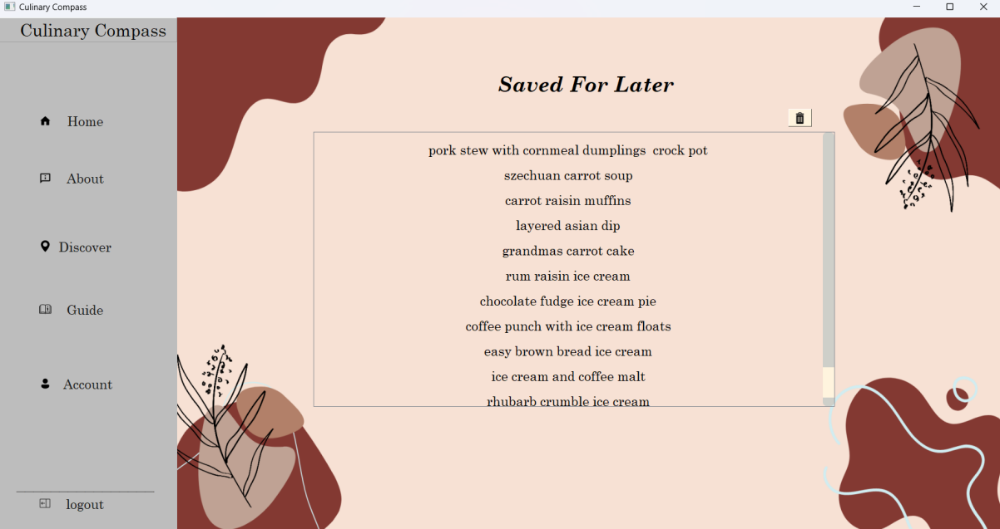
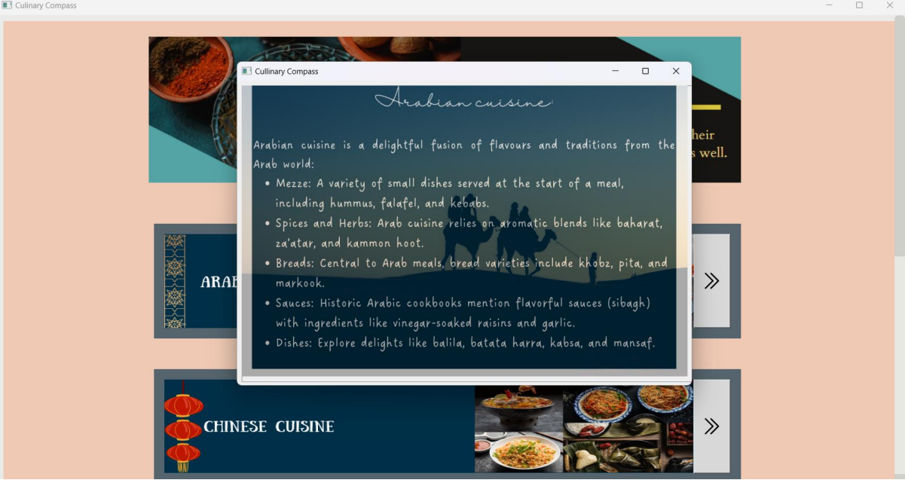

# 🍴 Culinary Compass

A Python + SQL based culinary app with a PyQt user interface.  
It suggests recipes based on available ingredients and allows users to search for restaurants with multiple filters.  

---

## ✨ Features
- ✅ Recipe suggestions from entered ingredients  
- ✅ Restaurant search with multiple filters  
- ✅ User-friendly PyQt GUI  

---
## 📸 Screenshots

Here are some previews of the main features of the app:

### Home Page

### Dish Selection

### Dining Out

### Discover

### Saved Recipes

### Cuisines

---
## 🛠️ Tech Stack
- **Python**  
- **SQL** (for database management)  
- **PyQt** (for GUI)  

---
Culinary-Compass/
│── culcompcode.py        # Main Python code  
│── database.sql          # Database with all data 
│── 1.png, 2.png ...      # Images  
|── display_home...       # Screenshots 
│── README.md             # Project documentation  

---
## 🚀 How to Run
1. Clone or download this repository

